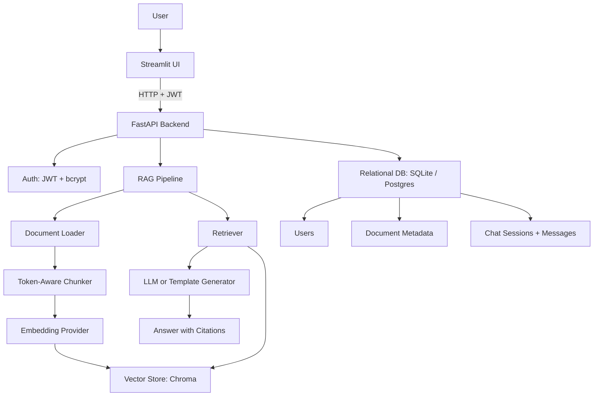

# Enterprise RAG

[](https://github.com/Tony-QianxiLU/enterprise-rag/actions/workflows/ci.yml)
[](LICENSE)

A production-shaped enterprise RAG platform: a FastAPI backend with JWT auth and role-based access, a decoupled Streamlit frontend, LangChain + LlamaIndex retrieval over a Chroma vector store, document ingestion for PDF/DOCX/PPTX/TXT/Markdown, persisted chat history, an admin dashboard, and an offline evaluation suite.

This project is part of my AI engineering portfolio. It builds directly on the retrieval and generation ideas from [ai-rag-chatbot](https://github.com/Tony-QianxiLU/ai-rag-chatbot) and answers the "how would you make this enterprise-ready?" question from that project's own interview prep: this repo adds auth, structured relational storage, an admin surface, and a vector store abstraction designed for a Postgres/pgvector migration.

## Features

- Upload `.pdf`, `.docx`, `.pptx`, `.txt`, and `.md` documents through an authenticated API.
- Chunk documents with token-aware splitting (tiktoken `cl100k_base`), sized against the embedding/LLM context budget.
- Embed and store chunks in a Chroma vector store behind a swappable `VectorStore` Protocol.
- Retrieve context and generate grounded answers with source citations.
- Fall back to deterministic local embeddings and template generation when no `OPENAI_API_KEY` is configured, so the app runs fully offline.
- Authenticate with OAuth2 password login and JWT bearer tokens; enforce admin-only routes for deletion and stats.
- Persist users, documents, chat sessions, and chat messages relationally (SQLite by default, Postgres-compatible via `DATABASE_URL`).
- Serve a decoupled Streamlit UI that talks to the API over HTTP only, plus an Admin page for platform stats.
- Evaluate RAG quality with a benchmark dataset, generated Markdown/JSON reports, and CI checks.
- Run quality checks with Ruff, pytest, and GitHub Actions.
- Run everything locally with `uv run`, or containerized with Docker Compose (API + frontend as separate services).

## Architecture



See [docs/architecture.md](docs/architecture.md) for sequence diagrams of the ingestion and chat flows, a component responsibility table, and design-decision rationale.

## Tech Stack

- Python 3.12
- FastAPI + Uvicorn
- Streamlit
- LangChain + LangChain OpenAI
- LlamaIndex (core + Chroma vector store integration)
- Chroma
- SQLAlchemy (SQLite locally, Postgres-compatible)
- pypdf, python-docx, python-pptx
- tiktoken
- PyJWT + bcrypt
- pydantic-settings
- pytest, pytest-asyncio
- Ruff
- uv
- Docker Compose
- GitHub Actions

## Folder Structure

```text
enterprise-rag/
|-- .github/
|   |-- ISSUE_TEMPLATE/
|   `-- workflows/
|-- data/
|   |-- chroma/
|   |-- uploads/
|   `-- evaluation_cases.jsonl
|-- docker/
|   |-- Dockerfile.api
|   `-- Dockerfile.frontend
|-- docs/
|   |-- api.md
|   |-- architecture.md
|   |-- deployment.md
|   |-- evaluation.md
|   `-- interview-prep.md
|-- reports/
|   |-- evaluation-report.md
|   `-- evaluation-report.json
|-- src/
|   `-- enterprise_rag/
|       |-- api/
|       |   |-- routers/
|       |   |   |-- admin.py
|       |   |   |-- auth.py
|       |   |   |-- chat.py
|       |   |   |-- documents.py
|       |   |   `-- health.py
|       |   |-- dependencies.py
|       |   `-- main.py
|       |-- auth/
|       |   |-- security.py
|       |   `-- seed.py
|       |-- evaluation/
|       |   `-- evaluate.py
|       |-- frontend/
|       |   |-- pages/
|       |   |   `-- 1_Admin.py
|       |   `-- app.py
|       |-- ingestion/
|       |   |-- chunking.py
|       |   `-- loaders.py
|       |-- providers/
|       |   |-- embeddings.py
|       |   `-- llm.py
|       |-- rag/
|       |   |-- memory.py
|       |   `-- pipeline.py
|       |-- retrieval/
|       |   |-- retriever.py
|       |   `-- vector_store.py
|       |-- config.py
|       |-- db.py
|       `-- schemas.py
|-- tests/
|-- docker-compose.yml
|-- .env.example
|-- pyproject.toml
|-- uv.lock
`-- README.md
```

## Installation

Install `uv` if needed:

```bash
brew install uv
```

Install dependencies:

```bash
uv sync
```

## Environment Variables

Create a local `.env` file from `.env.example`:

```bash
cp .env.example .env
```

Every field has a working local default -- the app runs fully offline without any of these set.

| Variable | Required | Purpose |
| --- | --- | --- |
| `OPENAI_API_KEY` | No | Enables OpenAI embeddings and LLM answer generation. Falls back to deterministic local providers when unset. |
| `OPENAI_MODEL` | No | Chat model used for grounded answer generation (default `gpt-4.1-mini`). |
| `EMBEDDING_MODEL` | No | OpenAI embedding model (default `text-embedding-3-small`). |
| `DATABASE_URL` | No | SQLAlchemy connection string for relational state (default `sqlite:///./data/enterprise_rag.db`). Swappable to Postgres. |
| `CHROMA_PERSIST_DIR` | No | Local Chroma persistence directory (default `data/chroma`). |
| `JWT_SECRET` | No (yes in production) | Secret used to sign access tokens. Must be overridden before any real deployment. |
| `ACCESS_TOKEN_EXPIRE_MINUTES` | No | JWT access token lifetime in minutes (default `720`). |
| `ADMIN_EMAIL` | No | Email for the admin account seeded on first startup. |
| `ADMIN_PASSWORD` | No (yes in production) | Password for the seeded admin account. Must be overridden before any real deployment. |
| `API_BASE_URL` | No | Base URL the Streamlit frontend uses to reach the FastAPI backend (default `http://localhost:8000`). |

Never commit real API keys or production secrets.

## Quick Start

Run the FastAPI backend:

```bash
PYTHONPATH=src uv run uvicorn enterprise_rag.api.main:app --reload
```

Run the Streamlit frontend (in a separate terminal, with the backend already running):

```bash
PYTHONPATH=src uv run streamlit run src/enterprise_rag/frontend/app.py
```

Or run both services with Docker Compose:

```bash
docker compose up --build
```

Seed (or re-verify) the admin account:

```bash
PYTHONPATH=src uv run seed-admin
```

The API defaults to `http://localhost:8000` and the frontend to `http://localhost:8501`. Log in with the seeded admin credentials from `.env` (`ADMIN_EMAIL` / `ADMIN_PASSWORD`).

## Running Tests and Lint

```bash
uv run ruff check .
uv run pytest
```

## Evaluation

Run the offline RAG evaluation suite:

```bash
PYTHONPATH=src uv run rag-evaluate
```

This writes:

- `reports/evaluation-report.md`
- `reports/evaluation-report.json`

Current benchmark result (5 cases, deterministic local providers):

| Metric | Result |
| --- | ---: |
| Retrieval accuracy | 100% |
| Citation coverage | 100% |
| Groundedness rate | 100% |
| Overall pass rate | 100% |

See [docs/evaluation.md](docs/evaluation.md) and [reports/evaluation-report.md](reports/evaluation-report.md).

## API Reference

See [docs/api.md](docs/api.md) for the full endpoint reference, including auth requirements and example request/response bodies.

## Deployment

See [docs/deployment.md](docs/deployment.md) for how to run this today (uv run, Docker Compose) versus forward-looking cloud deployment guidance that has not been implemented yet.

## Interview Preparation

See [docs/interview-prep.md](docs/interview-prep.md) for recruiter explanations, technical questions, architecture questions, system design prompts, STAR stories, and follow-up questions.

## Technical Highlights

- Clean separation between API, auth, ingestion, retrieval, generation, persistence, and evaluation layers.
- `VectorStore` is a Protocol, not a concrete dependency -- `ChromaVectorStore` is one implementation, and a pgvector-backed implementation can be swapped in without touching the pipeline, retriever, or API layer.
- Relational state (users, documents, chat sessions/messages) is stored via SQLAlchemy against `DATABASE_URL`, defaulting to local SQLite but written to be Postgres-compatible with a connection-string change only.
- JWT-based auth with bcrypt password hashing and role-based access control (admin-only delete and stats endpoints).
- Deterministic local embeddings and template-based generation make the app, tests, and evaluation suite fully reproducible offline and in CI, with zero paid API dependency.
- Citations are structured Pydantic/dataclass objects (`Citation`), not loose strings, carrying document id, source, chunk id, score, and preview.
- FastAPI and Streamlit are decoupled over HTTP -- the frontend has no direct imports from the RAG/retrieval/db layers, so any HTTP client (a React app, a mobile client) could reuse the same API unchanged.
- Evaluation CLI generates Markdown and JSON reports from a JSONL benchmark dataset and runs in CI on every push.

## Future Improvements

This is an MVP-scoped enterprise RAG platform. Known gaps, being explicit rather than glossing over them:

- No reranking -- retrieval returns raw vector-similarity top-k with no cross-encoder or LLM-based reranking pass.
- No hybrid search -- retrieval is vector-only today; there is no keyword/BM25 component to combine with it.
- No Postgres/pgvector migration has actually been done -- `DATABASE_URL` and the `VectorStore` Protocol are designed to make that migration a swap rather than a rewrite, but Chroma and SQLite are what actually run today.
- No multi-tenant isolation -- all documents and vectors live in a single shared collection; there is no per-organization or per-workspace partitioning yet.
- No rate limiting -- the API has no request throttling or abuse protection.
- `GET /chat/{session_id}/history` does not verify that the requesting user owns the session, so any authenticated user can read any session's history by id today.
- Conversational context is a fixed recent-message window (last 10 messages) with no summarization for longer conversations.
- No observability/metrics dashboard -- evaluation reports exist, but there is no trend tracking across runs.

## License

This project is released under the MIT License. See [LICENSE](LICENSE).

## Acknowledgements

- FastAPI and Uvicorn for the backend framework and ASGI server.
- Streamlit for fast internal-tool UI development.
- LangChain and LangChain OpenAI for LLM application primitives.
- LlamaIndex for the Chroma vector store integration.
- Chroma for local vector search.
- SQLAlchemy for relational persistence with a Postgres-compatible design.
- OpenAI for optional embeddings and grounded answer generation.
