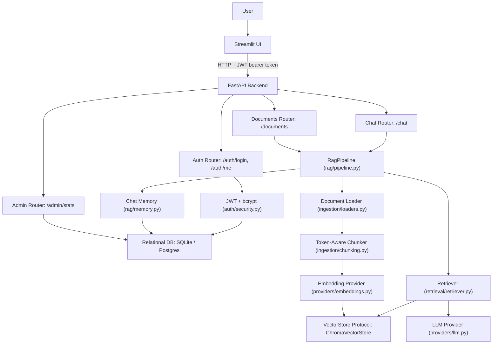
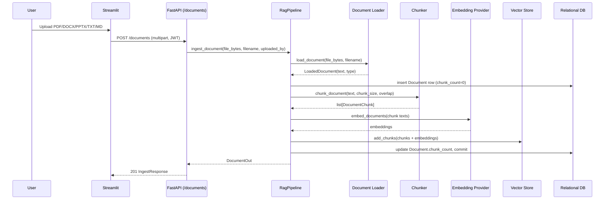
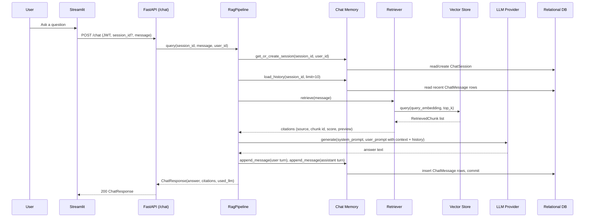

# Architecture

## Goal

Enterprise RAG is a multi-user, document-grounded question-answering platform. It takes the retrieval and generation core proven in [ai-rag-chatbot](https://github.com/Tony-QianxiLU/ai-rag-chatbot) and wraps it in the pieces an actual enterprise deployment needs: authentication, structured persistence, an admin surface, and a decoupled client/server split -- while staying simple enough to explain end to end in an interview.

## System Diagram

## Ingestion Flow

## Chat / Query Flow

## Components

| Component | Responsibility |
| --- | --- |
| `api/main.py` | FastAPI application factory; registers routers, CORS, and startup hooks (DB init, admin seeding). |
| `api/routers/auth.py` | OAuth2 password login and current-user profile lookup. |
| `api/routers/documents.py` | Document upload, listing, and admin-only deletion. |
| `api/routers/chat.py` | Chat message submission and session history retrieval. |
| `api/routers/admin.py` | Admin-only platform stats, including the last evaluation summary if present. |
| `api/dependencies.py` | Shared FastAPI dependencies: JWT-authenticated user resolution, admin gate, pipeline access. |
| `auth/security.py` | Password hashing (bcrypt via passlib) and JWT encode/decode. |
| `auth/seed.py` | Seeds the initial admin account on first startup. |
| `ingestion/loaders.py` | Extension-based dispatch to PDF/DOCX/PPTX/TXT/Markdown text extraction. |
| `ingestion/chunking.py` | Token-aware chunking with tiktoken (`cl100k_base`), sized against the model context budget. |
| `providers/embeddings.py` | `EmbeddingProvider` Protocol: deterministic local hash embeddings, or OpenAI embeddings when configured. |
| `providers/llm.py` | `LLMProvider` Protocol: deterministic template generation, or OpenAI chat completion when configured. |
| `retrieval/vector_store.py` | `VectorStore` Protocol and its `ChromaVectorStore` implementation. |
| `retrieval/retriever.py` | Embeds a query, retrieves top-k chunks, and builds structured `Citation` objects. |
| `rag/pipeline.py` | Orchestrates ingestion and query flows end to end; the seam between the API and every lower layer. |
| `rag/memory.py` | Chat session/message persistence and recent-history loading. |
| `evaluation/evaluate.py` | Offline benchmark harness: ingests a fixture corpus, runs benchmark questions, scores retrieval/citation/groundedness, writes reports. |
| `frontend/app.py` | Streamlit login, upload, and chat UI. Talks to the API over HTTP only. |
| `frontend/pages/1_Admin.py` | Streamlit admin dashboard page, calling `/admin/stats`. |
| `db.py` | SQLAlchemy models and session management for users, documents, chat sessions, and chat messages. |
| `config.py` | Centralized `pydantic-settings` configuration, loaded from environment variables / `.env`. |
| `schemas.py` | Shared Pydantic/dataclass contracts used across every layer above. |

## Design Decisions

### `VectorStore` as a deliberate seam for Chroma -> pgvector

`retrieval/vector_store.py` defines `VectorStore` as a `Protocol` with four methods: `add_chunks`, `replace_document_chunks`, `delete_document`, and `retrieve`. `ChromaVectorStore` is the implementation `get_pipeline()` wires up by default, using the raw `chromadb` client directly so this module owns the exact metadata schema (`document_id`, `source`, `index`) end to end. `retrieval/llamaindex_store.py` implements the same Protocol on top of `llama-index-vector-stores-chroma` instead -- same contract, different framework, embeddings still supplied by this project's own `EmbeddingProvider` rather than LlamaIndex's embedding abstraction -- to demonstrate the swap and give an apples-to-apples comparison between the two dominant retrieval frameworks (covered by `tests/test_llamaindex_store.py`, not wired into the default pipeline).

This Protocol boundary is also intentional groundwork for a future Postgres/pgvector backend: a `PgVectorStore` class implementing the same four methods (backed by a `pgvector` column and standard SQL upsert/delete/similarity-search queries) could be dropped into `rag/pipeline.py`'s `get_pipeline()` factory in place of `ChromaVectorStore`, with zero changes required to `RagPipeline`, `Retriever`, or any router. The migration has not been done -- Chroma is what actually runs today -- but the Protocol boundary is what makes that swap a substitution rather than a rewrite.

### SQLite now, Postgres-compatible later via `DATABASE_URL`

`db.py` uses SQLAlchemy's `create_engine(settings.database_url, ...)` with no SQLite-specific ORM code outside of the `check_same_thread` connect argument, which is only applied when the URL starts with `sqlite`. Switching to Postgres in production is meant to be a connection-string change (`DATABASE_URL=postgresql://...`) plus adding a driver dependency, not a schema or model rewrite. This keeps local development and CI fast and dependency-free while keeping the path to a real production database explicit and cheap.

### Deterministic local provider fallbacks for offline/CI testing

Both `EmbeddingProvider` and `LLMProvider` are Protocols with two implementations each: a deterministic local one (`HashEmbeddingProvider`, `TemplateLLMProvider`) and an OpenAI-backed one, selected in `build_embedding_provider` / `build_llm_provider` based on whether `OPENAI_API_KEY` is set. The evaluation harness (`evaluation/evaluate.py`) explicitly forces the local providers regardless of environment configuration, so the benchmark is reproducible in CI and never makes a paid API call or depends on external model availability. The same fallback is what lets the whole app -- ingestion, chat, tests -- run fully offline.

### JWT auth design

Login (`/auth/login`) uses FastAPI's `OAuth2PasswordRequestForm` (username=email, password) and verifies against a bcrypt hash stored via `passlib`. On success, `create_access_token` signs a JWT (`HS256`, configurable via `JWT_SECRET`/`JWT_ALGORITHM`) carrying `sub` (user id), `role`, and an expiry (`ACCESS_TOKEN_EXPIRE_MINUTES`, default 12 hours). `api/dependencies.py` decodes and validates the token on every protected route via `OAuth2PasswordBearer`, and `get_current_admin` layers a role check on top of `get_current_user` for admin-only routes (document deletion, admin stats). An admin account is seeded automatically on first startup (`auth/seed.py`) so the platform is usable immediately without a manual bootstrap step. This is a deliberately simple, stateless auth design appropriate for an MVP -- there is no refresh-token rotation, token revocation list, or multi-tenant claim in the payload yet.

### Why FastAPI + Streamlit are decoupled over HTTP

The Streamlit frontend (`frontend/app.py`, `frontend/pages/1_Admin.py`) imports only `schemas` and `config` from the backend package, and otherwise talks to the FastAPI service exclusively through `httpx` HTTP calls with a JWT bearer header -- it never imports `rag`, `retrieval`, or `db` directly. This means the frontend is just one possible client of a documented HTTP API (see [docs/api.md](api.md)): a React single-page app, a mobile client, or another internal tool could authenticate against `/auth/login` and call `/documents` and `/chat` today with no backend changes. It also lets the two processes scale, deploy, and fail independently, which is reflected in `docker-compose.yml` running `api` and `frontend` as separate services.
